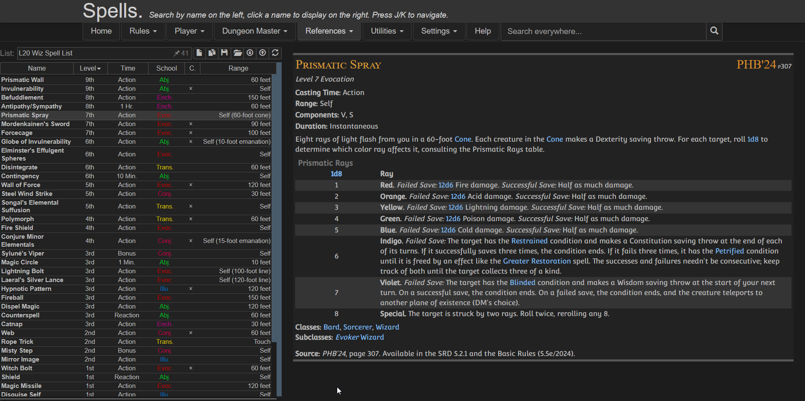

<div align= "center">
  <a href="https://5e.tools/" target="_blank" rel="noopener noreferrer">
    
  </a>
  <h1>5eTools Spell List Userscript</h1>
</div>

Fixes the awkward layout of the spell view on [5etools](https://5e.tools/) by creating a clean, split-screen interface.




## Features

- Moving the Pinned Spell List to the left
- Keeping spell details on the right
- Using full screen width efficiently
- Providing a clean, consistent reading experience
- Optional toggles via userscript settings:
    - Show/Hide Header
    - Show/Hide Navigation
    - Show/Hide Extra panel

> [!IMPORTANT]
> Create your spell list BEFORE enabling the script because Once the script is active:
> - The original UI is replaced
> - You won’t have access to the main spell browser anymore

## Installation

- Install a userscript manager: [Violentmonkey](https://violentmonkey.github.io/get-it/) (recommended), [Tampermonkey](https://www.tampermonkey.net/)
- Install the script via: [GreasyFork](https://greasyfork.org/en/scripts/574969-5etools-clean-spell-layout)

## Configuration

You can customize the layout using your userscript manager:
Violentmonkey dashboard > Edit the script > Go to Values / Script Settings

```json
{
  "showExtra": true,
  "showHeader": true,
  "showNav": false
}
```

## Credits

- [5etools](https://5e.tools/)